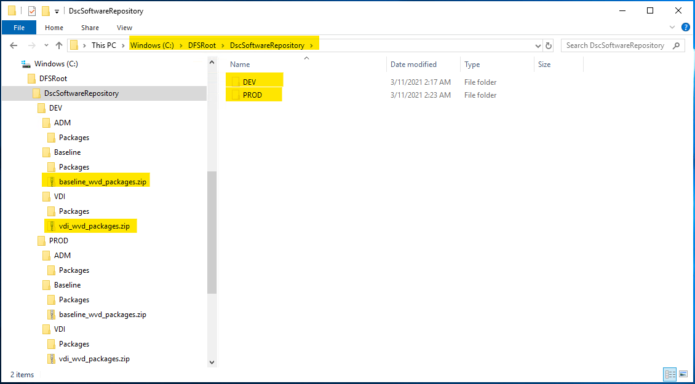
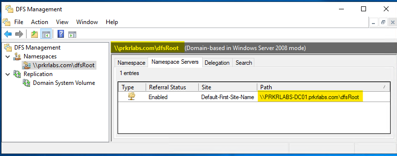
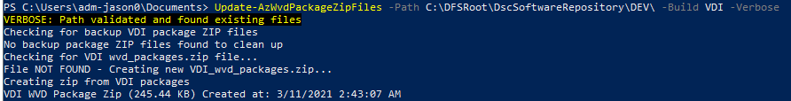

# Post Setup Configuration

You just completed the Azure Foundation Deployment which creates a variety of resource groups and resources to be used in the Automated WVD Deployment solution.  There are a few steps which are required before attempting to run the deployment code.

## STEP 1:  WVD Profile Container Location (AD Join Azure Files)

The foundation deployment creates a Storage Account and creates a file share called '*wvdartifacts*'. This file share was created for the purpose of storing the the FSLogix profile containers. If you'd rather host the profile containers through another storage system or some other process, just be sure you account for this change in the deployment code.

The AD joining process for Azure File Shares is well documented on the Microsoft Docs site.

[**Overview - on-premises Active Directory Domain Services authentication over SMB for Azure file shares**](https://docs.microsoft.com/en-us/azure/storage/files/storage-files-identity-auth-active-directory-enable?WT.mc_id=Portal-Microsoft_Azure_Storage#overview)

**You'll need thefull UNC path to the Azure File Share for the deployment code**

## STEP 2:  DSC Software Repository

The solution is configured to install some general applications using the public Chocolatey repository. I would highly recommend setting up a file share from which the Session Hosts can access. This file share should store software or scripts not found in Chocolatey.

For example, I would highly recommend using the [VDI Optimization Tool](https://docs.microsoft.com/en-us/windows-server/remote/remote-desktop-services/rds-vdi-recommendations-2004) supported by myself and a few of my colleagues which will need to be stored in a location that can be downloaded by the Session Hosts.

### Example

In my lab, I configured DFS on my Domain Controller and configured the directories like the below:

|| **DSC Software**
|-|-|
|| 

|| **DFS Configuration**
|-|-|
|| 

The underlying framework around the directory structure is based the properties you'll apply to your WVD Host Pools and configurations.  In this example, we have 2 environments; *DEV* and **PROD**.  Within each of these environments there are builds as outlined below:

- **Baseline:** Common software or applications that should be installed on *any* build
- **VDI:** This is a standard Windows 10 desktop with standard user applications
- **ADM:** This is for *administrative* desktops running Windows Server

This framework allows for a wide variety of options in your deployment configuration.  These are just recommendations and you cna use the framework in any way that suits you or your organization.

## STEP 3:  Import the Az.WvdOperations Custom Module

I have created quite a few custom functions which are used in this deployment solution.  The module is created as a PSM1 with a PSD1 configuration file in the .\PSModule directory.  The module is broken down into functions; theses are exported to your session and internal.  The internal commands are used by the main functions.

**Import the module (example)**
```PowerShell
Import-Module .\PSModule\Az.WvdOperations.psm1 -Force
```

**Exported Functions**
- Disable-AzWvdMaintanence
- Enable-AzWvdMaintanence
- Invoke-AzWvdSessionManager
- New-AzWvdDeployment
- New-AzWvdSessionHosts
- New-AzWvdSessionHostConfig
- Remove-AzWvdResources
- Update-FSLogixProfilePermissions
- New-AzWvdDscCompilationJob
- Update-AzWvdDscArtifacts
- Update-AzWvdPackageZipFiles
- Update-AzWvdTemplateArtifacts

## STEP 4:  Create your WVD Package Zip files

After importing the custom Az.WvdOperations module and configuring your DSC software repository, you should create the zip files of the packages you plan to install on your Session Hosts.

```PowerShell
Update-AzWvdPackageZipFiles -Path C:\DFSRoot\DscSoftwareRepository\DEV\ -Build VDI -Verbose
```

|| **Output**
|-|-|
|| 

### Next: Review deployment code and prepare for your first deployment!
