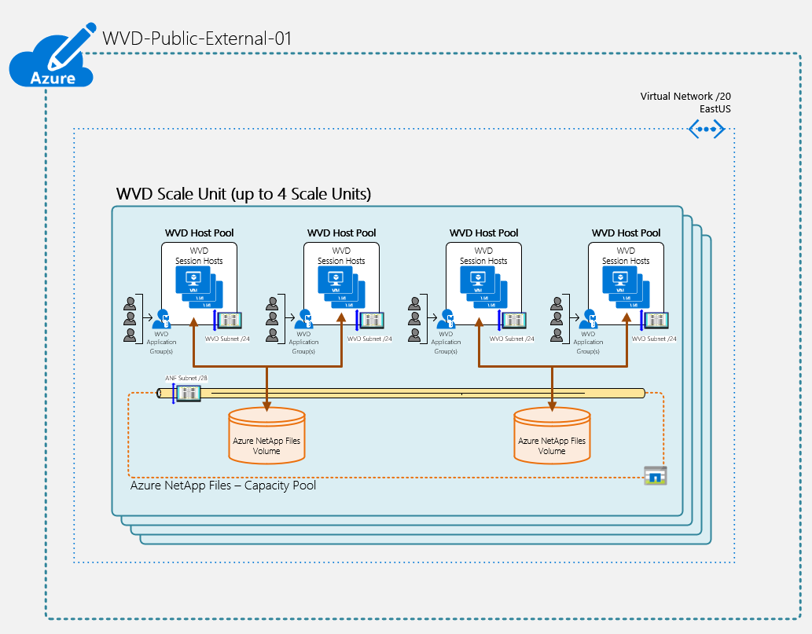
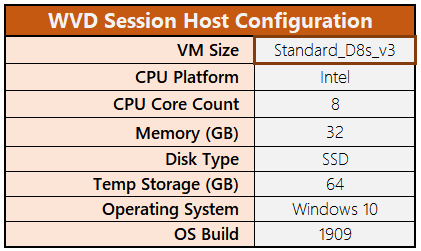
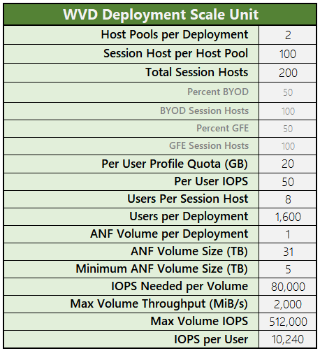
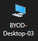

# Windows Virtual Desktop (WVD) Infrastructure

> Microsoft official documentation for WVD can be found [here](https://docs.microsoft.com/en-us/azure/virtual-desktop/).

The WVD infrastructure in the VA is built on a geographic model utilizing the three regions in Azure Public (i.e. EastUS, SouthCentralUS, and WestUS). Deploying infrastructure in these regions will provide the VA with the capacity to support employees across any time zone.  The following documentation is representative of a single region, but can be applied in principle to any region where WVD would be deployed.

## Workspace

Each Azure region supporting WVD will require a workspace.  The workspace is a logical grouping of application groups (app groups) in which users are assigned and given access to WVD.  The workspace is also the Azure resource which is published to the WVD Platform as a Service (PaaS) and what users subscribe to using the [Windows Desktop client](https://docs.microsoft.com/en-us/azure/virtual-desktop/connect-windows-7-and-10).

### App Group association

One of the critical steps in a WVD deployment is associating the various app groups with the WVD workspace.  Removing an app group from a workspace would also prohibit users from accessing the WVD resources aligned to this app group.

## Host Pool

Similarly to the workspace, a host pool is also a logical container for WVD resources.  The host pool contains the Azure virtual machines which have been registered to it.  These virtual machines act as session hosts and provide a virtual desktop experience for VA remote users.

A host pool can support two types of session hosts:

- Personal, where each session host is assigned to an individual user
- Pooled, where session hosts can accept connections from any user authorized to an app group within the host pool.

Currently, the VA deployment of WVD is based on a scale unit that can be deployed as many time as needed to increase the overall capacity of a specific region. The scale unit is method in which host pools, app groups and session hosts are deployed within an Azure region. The below figures illustrate these settings:

> 
>
> 

The scale unit consists of two host pools; Bring Your Own Device (BYOD) and Government Furnished Equipment (GFE).  The primary driver for these two host pools is due to existence of a smartcard middle-ware application in the VA called, HID ActivClient. The BYOD host pool is specifically designed to support VA users using their personal Windows 10 computer, which in most cases would not have ActivClient installed.  The GFE host pool has the ActivClient middle-ware installed just like physical GFE computers.

Each scale unit will be supported by an Azure NetApp Files (ANF) volume.  The ANF volume is where user profiles are created and stored for each scale unit. As noted in the illustration above, the current estimated profile size is approximately 20 GB.

> Note: User profiles cannot roam between scale units. Any user who has access to more than one set of virtual desktops, will have separate profiles in those respective desktop sessions.

### RDP Settings

The host pool also contains the settings for the Remote Desktop sessions.  These settings are applied during the deployment of the host pool.  Each setting has been listed below:

> Note: These settings **SHOULD NOT** be modified in the Azure portal. **ONLY** change these settings using PowerShell.

RDP setting |   Description |   Value
---|---|---
audiomode:i:value   |   Audio output location: Determines whether the local or remote machine plays audio   |   0
audiocapturemode:i:value    |   Microphone redirection: Indicates whether audio input redirection is enabled    |   1
encode redirected video capture:i:value |   Enables or disables encoding of redirected video    |   1
redirected video capture encoding quality:i:value   |   Controls the quality of encoded video   |   1
camerastoredirect:s:value  |    Configures which cameras to redirect. This setting uses a semicolon-delimited list of KSCATEGORY_VIDEO_CAMERA interfaces of cameras enabled for redirection |   *
drivestoredirect:s:value    |   Determines which disk drives on the local computer will be redirected and available in the remote session   |   *null*
redirectclipboard:i:value   |   Determines whether clipboard redirection is enabled |   0
redirectprinters:i:value    |   Determines whether printer redirection is enabled   |   0
use multimon:i:value    |   Determines whether the remote session will use one or multiple displays from the local computer |   0
singlemoninwindowedmode:i:value |   Determines whether a multi display remote session automatically switches to single display when exiting full screen. Requires use multimon to be set to 1. Only available on the Windows Desktop (MSRDC) client    |   1
maximizetocurrentdisplays:i:value   |   Determines which display the remote session goes full screen on when maximizing. Requires use multimon to be set to 1. Only available on the Windows Desktop (MSRDC) client    |   1
screen mode id:i:value  |   Determines whether the remote session window appears full screen when you launch the connection |   2
smart sizing:i:value    |   Determines whether or not the local computer scales the content of the remote session to fit the window size    | 0
dynamic resolution:i:value  |   Determines whether the resolution of the remote session is automatically updated when the local window is resized   |   1
authentication level:i:value    |   Defines the server authentication level settings    |   0
gatewaycredentialssource:i:value    |   Specifies the RD Gateway authentication method  |   0
Kdcproxyname:s:value    |   Defines the FQDN of the KDC Proxy server for smartcard authentication   |   kproxy.federation.va.gov

> Note: More details about these settings and other available settings can be found [here](https://docs.microsoft.com/en-gb/windows-server/remote/remote-desktop-services/clients/rdp-files?context=/azure/virtual-desktop/context/context).

### Session Limits and Load Balancing

#### Session Limits

The host pool defines how many users each session host can support at the same time along with how users are load balanced across the session hosts. Through a variety series of tests and performance benchmarking, the session hosts have been limited to eight simultaneous active users.  This aligns to the virtual machine size, D8s_v3, which is an 8 vCPU / 32 GB memory virtual machine.  Limiting sessions based on a 1:1 ratio (vCPU to user session) is a good mix of performance and density.

#### Load Balancing

A host pool can load balance the user connections in one of two ways:

- Breadth first: Spreads out the user sessions.
- Depth first: Loads user sessions on session hosts until the session limit is reached before allowing connections to another session host.

The current deployment settings are using, Breadth first mode.

### Desktop Friendly Name

By default, host pools will appear to the end user as "SessionDesktop".

In order to rename a hostpool, run the following PowerShell command, replacing the X's with the desired numbers, as well as the region within the Resource Group name.

`Update-AzWvdDesktop -ApplicationGroupName vac3X-wvd-hostpool-0X-DAG -Name SessionDesktop -ResourceGroupName WVD-PROD-MAP-EASTUS-POOL-RG-X -FriendlyName "BYOD-Desktop-0X"`

Friendly name example:

## Session Hosts

WVD Session Hosts are Azure Virtual Machines (VMs) that register to Windows Virtual Desktop as session hosts when the WVD agent is run.

### VM Infrastructure (NIC, Disk, Compute)

The Azure VM infrastructure, e.g., the NIC, disk, and compute resources, are deployed using Azure ARM templates, specifically the [Deploy-WVD-SessionHosts.json](https://github.com/department-of-veterans-affairs/windows-virtual-desktop/blob/master/ARM/WVD/Deploy-WVD-SessionHosts.json) template. 

High level overview of the functionality of this template:

- Deploys the base Windows 10 1909 Multi-Session image, which is updated every month by Microsoft
- Joins the VM to the *VA.GOV* domain
- Calls linked templates for the two Desired State Configuration (DSC) extensions, described below

### WVD Desired State Configuration (DSC)

This Azure DSC extension is responsible for configuring the base Windows 10 Multi-Session operating system into a WVD session host, by performing the following actions:

- Installs the WVD Agent and Bootstrap applications
- Registers the host to the WVD host pool

The ZIP containing the DSC PowerShell script and WVD agents can be found [here](https://datrgallerycontainer.blob.core.windows.net/gallaryartifacts/Configuration.zip).

> Note: This ZIP is maintained by the Microsoft WVD product group

The Azure ARM template responsible for the deployment of the Azure DSC extension, which calls the above ZIP, can be found [here](https://github.com/department-of-veterans-affairs/windows-virtual-desktop/blob/master/ARM/WVD/Deploy-WVD-SessionHosts.json).

### VA Desired State Configuration (DSC)

A second Azure DSC extension is processed which customizes the base Windows 10 operating system to provide an experience similar to that of a VA GFE. Since we do not use a pre-built image, rather Infrastructure as Code, this DSC extension is responsible for installing applications, import certificates, set the local administrators group, modify registry keys, and more. 

The PowerShell script for this DSC extension can be found [here](https://github.com/department-of-veterans-affairs/windows-virtual-desktop/blob/master/DSC/WvdWin10Config.ps1).

The Azure ARM template responsible for the deployment of the Azure DSC extension, which calls the above PowerShell script, can be found [here](https://github.com/department-of-veterans-affairs/windows-virtual-desktop/blob/master/ARM/WVD/WvdWin10Config.json).

### User Profiles

User profiles are configured and maintained by a technology called [FSLogix](https://docs.microsoft.com/en-us/fslogix/overview), and are stored on Azure NetApp Files volumes as vhdx files. Having these FSLogix user profiles stored in a central location, outside of the WVD session hosts, allows user data and configurations to be persistent across each login to the WVD service, including when logging into a different WVD host than the previous login. The Profile containers appear to the user as if they are located on the local drive of the WVD host.

> Note: Users profiles will only attach to one WVD session at a time, therefore, users should not expect to see their stored data across two or more desktops at the same time. The additional login will be created with a temporary profile, which will not persist.

The FSLogix configuration is handled through the VA Azure DSC extension. For detailed reference, see the linked PowerShell script. High level FSLogix configuration steps:

1. Install the FSLogix package
2. Add required registry keys

User profiles are separated into two containers; general Profile and Office. Separating the Office data into its own container allows for higher flexibility, such as more efficient backups.

#### Profile Container

The Profile Container persists any user data or configurations, such as documents, desktop wallpaper, desktop icons, browser favorites, etc.

> Note: We recommend storing any important documents in either OneDrive or a mapped drive, just in case the user profile becomes corrupt, causing data loss.

#### Office Container

The Office Container persists only the portion of the profile that contains Microsoft Office data, such as Outlook .OST file, Teams, or OneNote data.

## App Groups

WVD app groups are logical groups within the WVD resource space which provide access to session desktops or applications hosted by a host pool.  For each host pool there can only be a single desktop application group (DAG) while there can be any number of published app groups.  Currently, the VA is not using the published app group and is only creating the DAG within each host pool. App groups following the naming convention for the host pools and have `'-DAG'` affixed to the end.

> Note:  The DAG is created during the deployment process, which is outlined [below](#WVD-Deployment-Process).

### User Assignment

App groups can accept direct user assignment or group assignment.  Currently, there is not a programitc approach to the user assignments, which makes single user assignment cumbersome.  In the deployment for the VA, groups will be assigned to app groups in order to provide access to the DAG.

## Azure NetApp Files

> Note: Microsoft offical documentation on Azure NetApp Files can be found, [here](https://docs.microsoft.com/en-us/azure/azure-netapp-files/azure-netapp-files-introduction).

WVD is similar to Remote Desktop Services (RDS) in that user profiles must be maintained to provide a good user experience. Azure NetApp Files (ANF) is one of several storage options for user profiles and was selected for the VA implementation based on its ability to easily scale by size and performance. ANF is comprised of three types of resources:

- ANF Accounts
- ANF Capacity Pools
- ANF Volumes

ANF is an Azure fabric level resource and requires a delegated subnet to function.  Each region will have a single /27 virtual network for this delegation.  More information can be found on the [Microsoft Docs](https://docs.microsoft.com/en-us/azure/azure-netapp-files/azure-netapp-files-delegate-subnet) site.

Deployment of the ANF account, capacity pools, and volumes is perfomed using PowerShell and leverages a JSON Azure Resource Manager (ARM) template ([Deploy-ANF-Volume-Template.json](https://github.com/department-of-veterans-affairs/windows-virtual-desktop/blob/master/ARM/ANF/Deploy-ANF-Volume-Template.json)) and parameter file ([Deploy-ANF-Volume.parameters.json](https://github.com/department-of-veterans-affairs/windows-virtual-desktop/blob/master/ARM/ANF/Deploy-ANF-Volume-Template.parameters.json))

> **Example PowerShell command syntax**
>
>`New-AzResourceGroupDeployment -ResourceGroupName WVD-PROD-MAP-EASTUS-SVCS-RG' -TemplateFile .\Deploy-ANF-Volume-Template.json -TemplateParameterFile Deploy-ANF-Volume.parameters.json`

### ANF Accounts

For the VA deployment, a single ANF account will be created in each Azure region.  This ANF account will have an Active Directory (AD) connection, which utilizes a Service Account to create a computer account in the VA AD for the ANF volumes.

> Note: Only one AD connection can exist per ANF account.

### ANF Capacity Pools

An ANF capacity pool is not only a reserved amount of space to create volumes from, but it is also the basis for how the storage cost is calculated and billed. An ANF capacity pool has a minimum size of 4 TB and a maximum size of 500 TB, but can be resized dynamically through the Azure portal or REST API calls.

> Note: An ANF capacity pool should continue to be resized to accomodate as many volumes as the 500 TB size will allow.

### ANF Volumes

ANF volumes provide high performance, centralized storage and allows persistent user profiles across session hosts. As outlined in the [scale unit](#Host-Pool) section describing the host pools, a single ANF volume will be used for each *pair* of host pools (BYOD and GFE).  This will ensure that regardless of which host pool a user connects to, they will maintain the same profile.

## Dependencies

### Directory Services

> Operations and Maintenance of these services is owned by the VA Directory Services team.

- KDC Proxy
    - Kerberos Key Distribution Center (KDC) Proxy Protocol (KKDCP) provides a mechanism for a client to use a KKDCP server to securely obtain Kerberos service tickets. This allows users outside of the VA network to authenticate to WVD session hosts using their smart card.
- ADFS
- Azure AD
