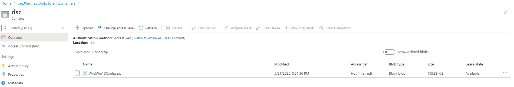
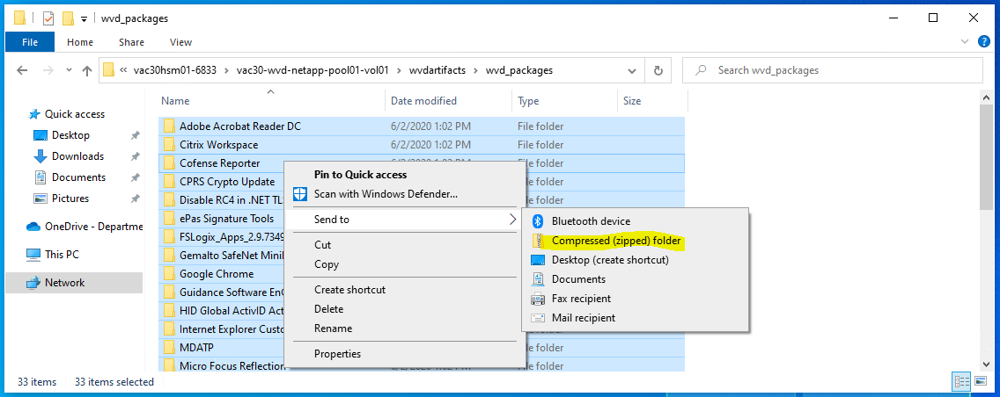
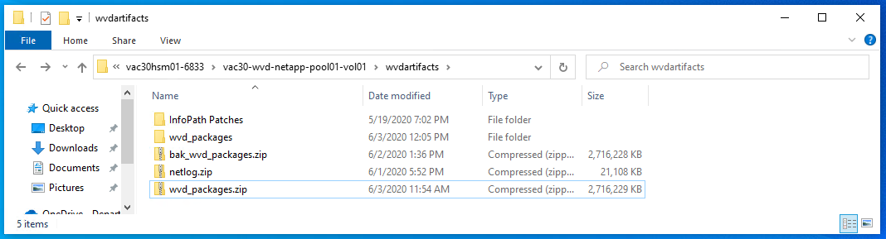

# WVD Operations and Maintenance (O&M)

## Backup and Restore
### Session Hosts and User Data
Infrastructure as Code, user profile data stored on Azure NetApp Files, and the [ephemeral](https://www.merriam-webster.com/dictionary/ephemeral) nature of the WVD Session Hosts, allows us to abstract the user data from the Windows operating system. This abstraction provides us the ability to backup **only** the user profile data.

> Note: The C:\ drive is "hidden" by design, discouraging users from saving data outside of their user profiles.

> Note: As of 6/5/2020 we have not implemented automatic backups of Azure NetApp Files. 

To backup user profile data, we use [Azure NetApp Files volume snapshots](https://docs.microsoft.com/en-us/azure/azure-netapp-files/azure-netapp-files-manage-snapshots). The linked document shows step-by-step how to backup and restore volumes.

### KDC Proxy Servers

> Operations and Maintenance, including redeployment, of KDC Proxy is owned by the VA Directory Services team.

The KDC Proxy servers will not be backed up, as they don't hold any data and they are redeployable in about 5 minutes. The recovery strategy is to redeploy these servers.

For redeployment, please reach out to VA Directory Services.

### NPM Server

The NPM server will not be backed up, as it does hold any data, is not critical to the WVD infrastructure, and has a 10 minute redployment time. The recovery strategy is to redeploy this server(s).

At a high level:
1. Deploy a VA compliant Windows Server 2016 VM in the core network, in the proper region
2. Enroll the VM in Azure Log Analytics and the NPM solution

> Need to add more detail to steps to redeploy NPM server.

## Patch Management
Due to the ephermeral nature of the WVD Session Hosts, we will **not** be running Windows Update on these systems. Rather, we will redeploy the entire WVD Session Host VM infrastructure, in each host pool, each month. Upon redployment of the VMs, the latest Windows 10 Multi-Session image is pulled from the Azure Marketplace. This base image is kept up to date by Microsoft, to include each months cumulative update. By redeploying all Session Host VMs each month, our WVD infrastructure will stay compliant with the latest patches, all without the need to run Windows Updates, implement WSUS, or SCCM agents. 

Steps to redeploy the WVD Session Host VMs:
1. Identity the maintenance window (4 hours)
2. Delete the Session Host VM resources (including VM objects, NICs, and disks) for the Scale Unit which will be redeployed
3. Follow the [deployment guide](../Deployment/deploymentguide.md) to redeploy the scale unit


## Adding or Updating Software with Desired State Configuration (DSC)
For information on how we use DSC within the WVD deployment, click [here](../Infrastructure/wvd_infrastructure.md###VA-Desired-State-Configuration-(DSC)). 

### Adding Software
Adding software to the WVD Windows 10 baseline involves three main steps:

1. Update PowerShell DSC Code on GitHub
2. Update the PowerShell DSC Code ZIP on Azure Storage Account
3. Update Software Packages ZIP on Azure NetApp

> Note: Before adding new software to the WVD Windows 10 baseline, VA **processes and approvals** must be met.

> Note: Any software added or changes made to the baseline will not take effect until the next round of VM deployments, as the DSC does not target currently running VMs(WVD Session Hosts). 

#### Update PowerShell DSC Code
Use the below examples when adding new software. You will need the following information:

- Name
- Path of the installer
- ProductId (Not applicable to EXEs)
- Arguments
- LogPath
- IgnoreReboot
    - In most cases this will be '$true' since a reboot is performed at the very end of the configuration anyway
- DependsOn
    - Any dependencies the software may have

> Note the difference between MSI and EXE installers. EXEs do NOT have a 'ProductId', as shown below, so DSC relies entirely on the 'Name' parameter being correct. With MSIs, DSC uses a combination of 'Name' and 'ProductId' to check install status.

##### MSI Example
```PowerShell
xPackage AdobeAcrobatReaderDC
{
    Ensure = "Present"
    Name = "Adobe Acrobat Reader DC"
    Path = "C:\Temp\packages\dscpackages\Adobe Acrobat Reader DC\20.006.20042\MSI\AcroRead.msi"
    ProductId = "AC76BA86-7AD7-1033-7B44-AC0F074E4100"
    Arguments = 'TRANSFORMS="C:\Temp\packages\dscpackages\Adobe Acrobat Reader DC\20.006.20042\MSI\AcroRead.mst" /update "C:\Temp\packages\dscpackages\Adobe Acrobat Reader DC\20.006.20042\MSI\AcroRdrDCUpd2000620042.msp" EULA_ACCEPT=YES ALLUSERS=1 REBOOT=R'
    LogPath = "$logPath\Adobe_Acrobat_Reader_DC_20.006.20042.log"
    IgnoreReboot = $true
}
```

##### EXE Example
```PowerShell
xPackage MicrosoftOneDrive
{
    Ensure = "Present"
    Name = "Microsoft OneDrive"
    Path = "C:\Temp\packages\dscpackages\OneDrive\19.222.1110.0011\OneDriveSetup.exe"
    ProductId = ''
    Arguments = "/allusers"
    DependsOn = "[xPackage]MicrosoftOffice365"
}
```

> Note: After saving the required changes to the code, commit and push the changes to the GitHub 'dev' branch. You may then open a pull request to merge those changes into 'master'

#### Update the PowerShell DSC Code ZIP on Azure Storage Account
After the changes are approved, you must then update the ZIP that contains the DSC code hosted on an Azure storage account. This ZIP is used by the Azure DSC Extension to download the PowerShell DSC code and modules to the target VMs (aka WVD Session Hosts).

To do this, perform the following steps on your machine:
1. Install the 'Az' PowerShell module
    ```PowerShell
    Install-Module -Name Az -Force -AllowClobber
    ```
2. Install PowerShell DSC modules required by WVD
    ```PowerShell
    Install-Module -Name <name of module>
    ```
    - As of June 2020, the following modules are required
        - PSDesiredStateConfiguration (this should already be installed on Windows 10/Server 2016 and above)
        - xPSDesiredStateConfiguration
        - CertificateDsc
        - ComputerManagementDsc
3. Open PowerShell and navigate to the directory containing the "WvdWin10Config.ps1" updated in the previous section.
4. Create the PowerShell DSC code and modules ZIP
```PowerShell
Publish-AzVMDscConfiguration '.\WvdWin10Config.ps1' -OutputArchivePath 'C:\Temp\WvdWin10Config.zip'
```
> Note: You can create this zip wherever you'd like, just **not** in the GitHub repo path, please. I suggested C:\Temp for that reason.

> Note: It is important to keep the name of the ZIP exactly as illustrated: WvdWin10Config.zip

5. Upload this newly created ZIP to the 'dsc' blob container of the following Azure Storage Account, replacing the existing zip:
- Storage Account: vac30artifactblobstore
- Resource Group: WVD-CORE-MAP-EASTUS-SVCS-RG
- Subscription: WVD-Public-Core

> Example: 


#### Update Software Packages ZIP on Azure NetApp
The PowerShell DSC code illustrated above references a ZIP file called "wvd_packages.zip". This ZIP file contains all of the software packages installed. In order to add new software, this ZIP must be updated with the new packages.

1. In your file explorer, navigate to the following path: `\\vac30hsm01-6833\vac30-wvd-netapp-pool01-vol01\wvdartifacts`
2. Note the contents of this directory
    - You will notice the "wvd_packages.zip" as well as the extracted directory called "wvd_packages"
3. Open the "wvd_packages" directory, **NOT the ZIP file**
4. Add the required packages, within a subdirectory
5. Highlight the contents of the folder, right click, select "Send to" and select "Compressed (zipped) folder
> Note: For DSC to function properly, the individual package directories must be at the **root** of the ZIP file, which is why we must do this in a specific way. Picture below for reference: 

6. Name the newly created ZIP "wvd_packages.zip"
> Note: It is important to keep the name of the ZIP exactly as illustrated: wvd_packages.zip
7. Rename the old ZIP in the parent path, for backup purposes
8. Move the newly created ZIP to the parent path, so the complete path of the newly created ZIP is: `\\vac30hsm01-6833\vac30-wvd-netapp-pool01-vol01\wvdartifacts\wvd_packages.zip`
> Example: 


### Updating Software
The process for updating existing software is very similar to adding new software. Before updating any software, ensure that all VA processes and approvals are met.

Please reference the steps in [Adding Software](#Adding-Software)

Differences between "Adding Software" and "Updating Software"
- Rather than adding new blocks of PowerShell DSC code, you will be updating version numbers for existing blocks of code
- Rather than adding a new directory to the software ZIP, you will be updating the MSI or EXE within those directories

All other steps are the same, including updating the PowerShell DSC code, updating the PowerShell DSC code ZIP, and updating the software packages ZIP.

> Note: Sometimes the 'Name', 'ProductId', or 'Arguments' may change between versions of the software. These requirements will need to be updated in the PowerShell DSC code. Ensure that the 'Path', 'LogFile', and any other parameters are updated with the new EXE or MSI names/versions, if applicable. 

## Troubleshooting Tools
### Log Analytics

Through Azure Policy, each of the WVD resources has diagnostic logging enabled and are configured to send logs to Azure Log Analytics (ALA) in East US, South Central US, or West US.

The queries below are provided as an example of the data that is availble from ALA. Modification of the queries may result in additional details for troubleshooting the environment. 

#### Errors for a specific user
```
WVDErrors
| where UserName == "userupn@va.gov"
|take 100
```

#### Occurrence of a specific error
```
WVDErrors
| where CodeSymbolic =="ErrorSymbolicCode"
| summarize count(UserName) by CodeSymbolic
```

#### Error occurrence across all users
```
WVDErrors
| where ServiceError =="false"
| summarize usercount = count(UserName) by CodeSymbolic
| sort by usercount desc
| render barchart
```

#### To get list of connections made by your users:
```
WVDConnections
| project-away TenantId,SourceSystem
| summarize arg_max(TimeGenerated, *), StartTime =  min(iff(State== 'Started', TimeGenerated , datetime(null) )), ConnectTime = min(iff(State== 'Connected', TimeGenerated , datetime(null) ))   by CorrelationId
| join kind=leftouter (
    WVDErrors
    |summarize Errors=makelist(pack('Code', Code, 'CodeSymbolic', CodeSymbolic, 'Time', TimeGenerated, 'Message', Message ,'ServiceError', ServiceError, 'Source', Source)) by CorrelationId
    ) on CorrelationId    
| join kind=leftouter (
   WVDCheckpoints
   | summarize Checkpoints=makelist(pack('Time', TimeGenerated, 'Name', Name, 'Parameters', Parameters, 'Source', Source)) by CorrelationId
   | mv-apply Checkpoints on
    (
        order by todatetime(Checkpoints['Time']) asc
        | summarize Checkpoints=makelist(Checkpoints)
    )
   ) on CorrelationId
| project-away CorrelationId1, CorrelationId2
| order by  TimeGenerated desc
```

#### To view feed activity of your users:
```
WVDFeeds
| project-away TenantId,SourceSystem
| join kind=leftouter (
    WVDErrors
    |summarize Errors=makelist(pack('Code', Code, 'CodeSymbolic', CodeSymbolic, 'Time', TimeGenerated,'Message', Message ,'ServiceError', ServiceError, 'Source', Source)) by CorrelationId
    ) on CorrelationId    
| join kind=leftouter (
   WVDCheckpoints
   | summarize Checkpoints=makelist(pack('Time', TimeGenerated, 'Name', Name, 'Parameters', Parameters,'Source', Source)) by CorrelationId
   | mv-apply Checkpoints on
    (
        order by todatetime(Checkpoints['Time']) asc
        | summarize Checkpoints=makelist(Checkpoints)
    )
   ) on CorrelationId
| project-away CorrelationId1, CorrelationId2
| order by  TimeGenerated desc
```

#### All connection for a single user:
```
WVDConnections
|where UserName == "userupn"
|take 100
|sort by TimeGenerated asc, CorrelationId
```

#### Number of connections for a user by day:
```
WVDConnections
|where UserName == "userupn"
|take 100
|sort by TimeGenerated asc, CorrelationId
|summarize dcount(CorrelationId) by bin(TimeGenerated, 1d)
```

#### Session duration by user
```
let Events = WVDConnections | where UserName == "userupn" ;
Events
| where State == "Connected"
| project CorrelationId , UserName, ResourceAlias , StartTime=TimeGenerated
| join (Events
| where State == "Completed"
| project EndTime=TimeGenerated, CorrelationId)
on CorrelationId
| project Duration = EndTime - StartTime, ResourceAlias
| sort by Duration asc
```