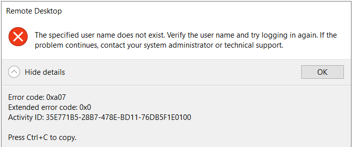

# Authentication Issue when Computer is Joined to Domain Other than *va.gov*
## Symptom
Computers that are domain joined to domains or forests other than *va.gov* experience authentication issues when connecting to a Windows Virtual Desktop session.

## Cause
By design, domain joined systems won't trust kerberos tickets from other domains, for example, *contoso.com*. This does not impact WORKGROUP (non domain joined) computers.

## Resolution
Adding the VA Intermediate Certificate Authority (CA) certificate to the Enterprise NTAUTH store allows kerberos tickets from *va.gov* to be trusted.

- Download the ICA certificate from: [va.gov CRL Distrubution Point Website](http://aia.pki.va.gov/pki/aia/va/VA-Internal-S2-ICA1-v1.cer)

- On the client computer exhibiting the issue, open Command Prompt as an administrator, and run the following: `certutil -enterprise -addstore NTAuth VA-Internal-S2-ICA1-v1.cer`

    > Note: It is recommended to contact your local IT department prior to running the above command.

- Try to connect to the Windows Virtual Desktop session

## Additional Information

PIV Trust Stores: https://piv.idmanagement.gov/networkconfig/trustedroots/